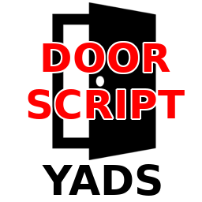
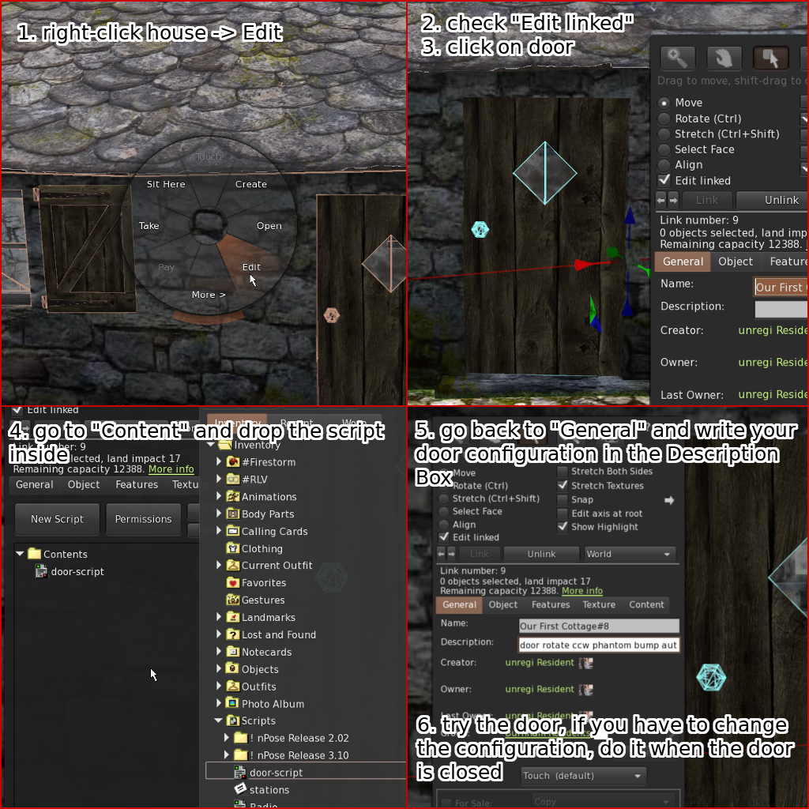
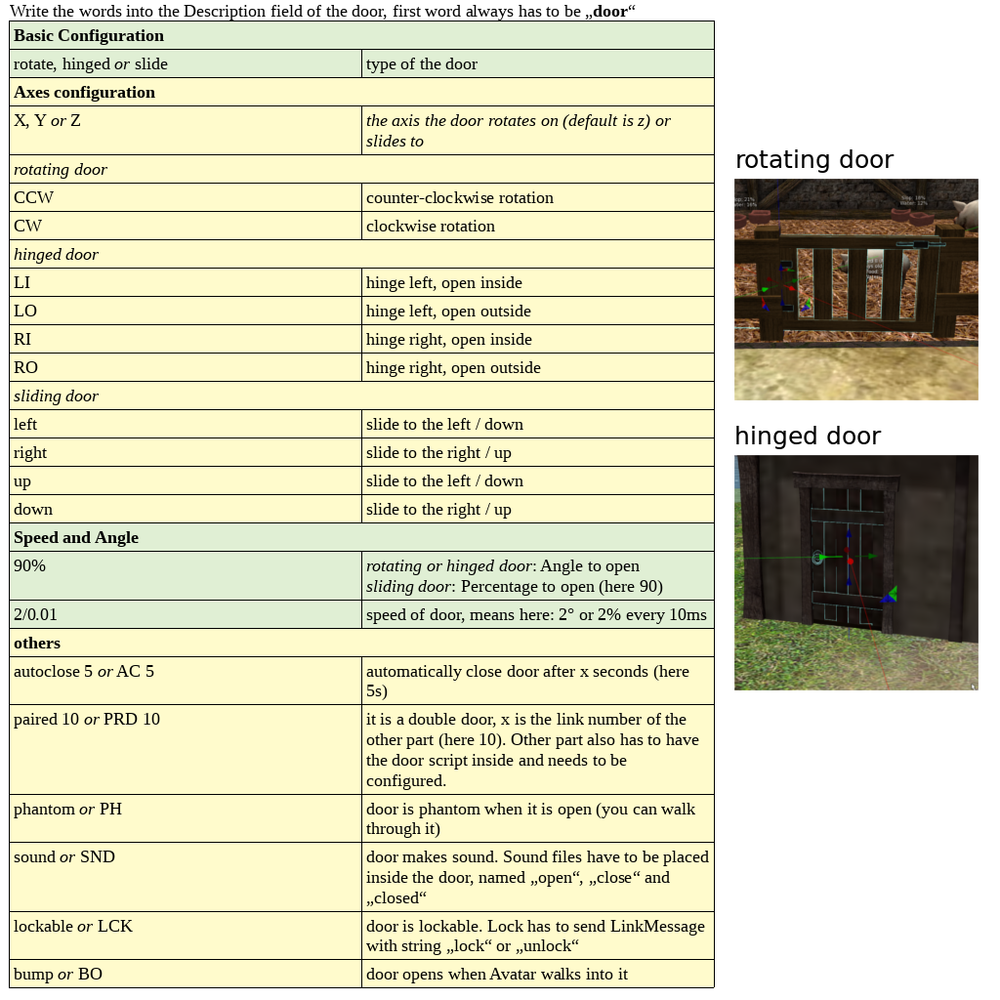
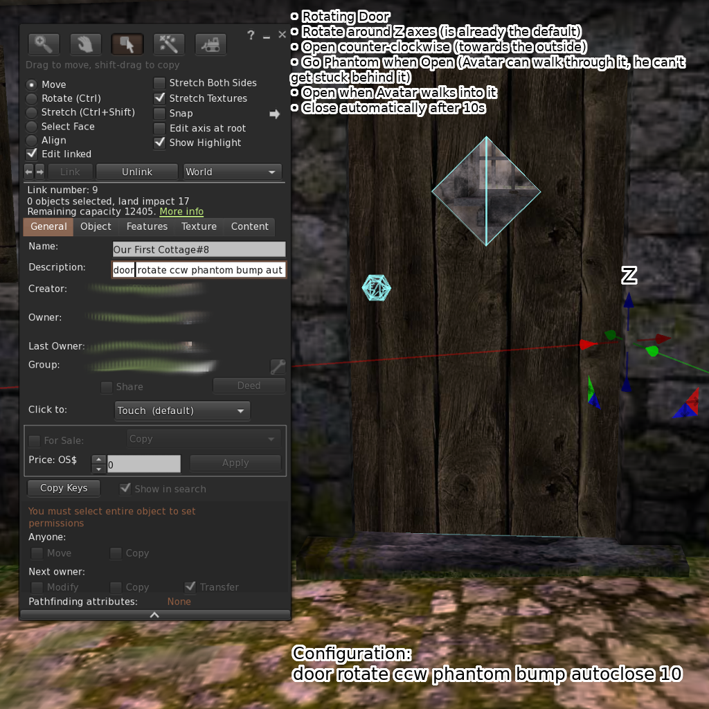
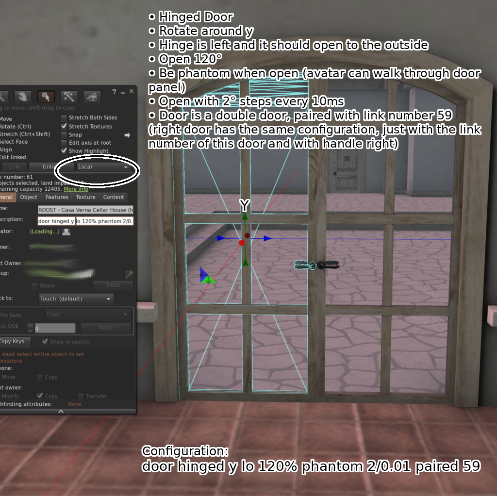

# YADS - Yet Another Door Script

This is a simple script for opening and closing doors in OpenSim and Second Life.
It works with standalone doors, with doors that are linked, doors that are "cut" (so that they need simple rotation),
doors that are not cut, sliding doors, paired doors and various combinations. It has features like sound, autoclose, lockable (lock has to send linkMessage to door) and open when Avatar bumps into it.
This script is aimed to be useable for nearly all cases of doors, while at the same time having a fast setup. The configuration happens in the Description field of the door.

##Installation
1. Create a Script and copy the source code from **src/door-script.lsl** inside.
2. Edit your door (if it is a linked object, check edit linked in the Edit window and click on the door)
3. Drag&Drop the script inside "Content" of the door
4. Write your configuration into the Description field in "General"
5. Test the door, if you have to change the configuration, do it when the door is closed

##Configuration
All the configuration happens in the Description field of the door. See this image for available configuration options:

**Note:** Door Type "rotate" has to be used for doors where the center of the axes is at the edge of the door (many doors are made like this, so that scripting is easier - simple rotation is easier than rotating and moving). If the center of the axes is in the center of the door, "hinged" has to be used. See the examples.

##Examples
- A rotating door as described above (center of the axes on the edge):

- A hinged double door

- A sliding door

